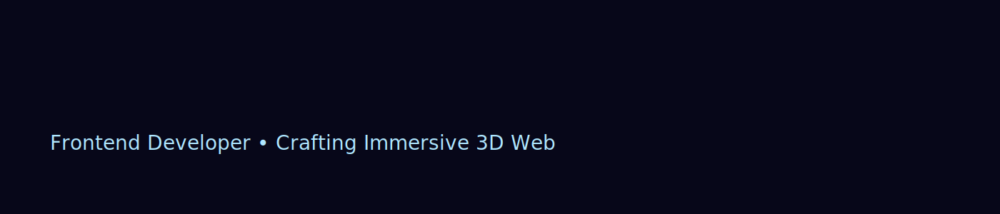

# 👋 Hi, I'm Ashish Sharma

**Frontend Developer • 3D Web (Three.js / WebGL / React) • GSAP**

📧 ashish8389sharma@gmail.com • 📱 +91 8827718774  
🔗 https://www.linkedin.com/in/ashish8822/

---

## 🚀 About Me

I build immersive 3D web experiences, shader visuals, interactive UI and real-time animations using  
**Three.js • WebGL • GSAP • GLSL • React**.

---

## 🎨 Featured — Blob Mixer (Interactive)

**Live:** https://lnkd.in/dBphVcUA  
**Code:** https://lnkd.in/dq_c6ENX  

**Highlights**
- Real-time GLSL deformation  
- Noise-powered animation & blending  
- Minimal UI, drag & sculpt interactions  

---

## 👕 3D Jersey Showcase (Product Viewer)

**Live:** https://jersy.vercel.app/  
**Code:** https://lnkd.in/ddQSi8Ac  

*Highlights*
- 360° product view, color picker, hotspots  
- HDR-like lighting, music toggle, full-screen viewer

---

## 🛠 Skills
*JavaScript · React · Three.js · WebGL · GSAP · GLSL*  
*Git · GitHub · Figma · Blender · Photoshop · Vite*

---

## 🛠 Tech Stack

  

---

## 📊 GitHub Stats

  
  

  

## 🌐 Connect With Me

  
  
  

  <b>Building immersive web experiences.🧑‍💻</b> 

